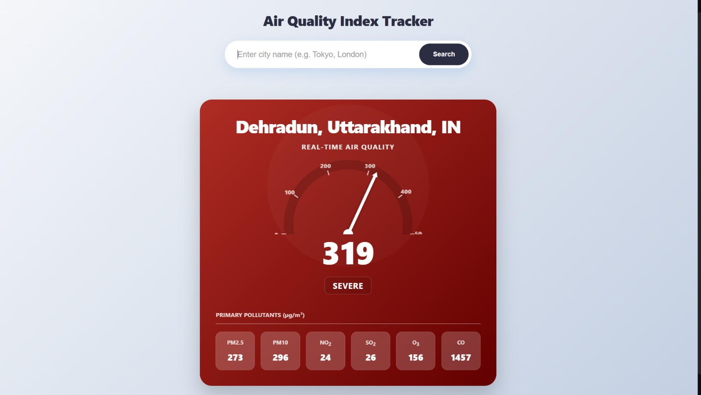

🌍 Air Pollution Project

A React-based web application that allows users to check real-time air pollution data for any city using OpenWeatherMap APIs.

The app converts a city name into geographical coordinates and then fetches accurate air quality data such as AQI and pollutant concentrations, helping users better understand environmental conditions.

🚀 Features

🔍 Search air pollution data by city name

🌐 Converts city → latitude & longitude using Geocoding API

📊 Fetches real-time air quality data using Air Pollution API

🧪 Displays:

Air Quality Index (AQI)

PM2.5, PM10

CO, NO₂, SO₂, O₃, NH₃

⚡ Fast and responsive UI built with React + Vite

🧱 Tech Stack

React

Vite

JavaScript

HTML & CSS

OpenWeatherMap APIs

🔌 APIs Used
1️⃣ OpenWeatherMap Geocoding API

Used to convert a city name into latitude and longitude.

🔗 https://openweathermap.org/api/geocoding-api

2️⃣ OpenWeatherMap Air Pollution API

Used to fetch real-time air quality and pollutant data based on coordinates.

🔗 https://openweathermap.org/api/air-pollution

✅ A single OpenWeatherMap API key is used for both APIs.

📸 UI Preview

📦 Installation & Setup
1️⃣ Clone the repository
git clone https://github.com/milan-2604/Air-Pollution-Project.git
cd Air-Pollution-Project

2️⃣ Install dependencies
npm install

3️⃣ Setup Environment Variables

Create a .env file in the root directory and add:

VITE_AIR_POLLUTION_API=http://api.openweathermap.org/data/2.5/air_pollution

VITE_GEOCODING_API=http://api.openweathermap.org/geo/1.0/direct 

VITE_API_KEY=your_api_key_here

4️⃣ Run the application
npm run dev

Open your browser at:

http://localhost:5173

🔄 How It Works

User enters a city name

App calls the Geocoding API to get latitude & longitude

Coordinates are passed to the Air Pollution API

Air quality data is displayed on the UI

📁 Project Structure
Air-Pollution-Project/
├── public/
├── src/
│   ├── components/
│   ├── services/        # API calls
│   ├── App.jsx
│   └── main.jsx
├── assets/
│   └── Ui.png
├── .env
├── index.html
├── package.json
├── vite.config.js
└── README.md

🤝 Contributing

Contributions are welcome! 🚀

Fork the repository

Create a new branch:

git checkout -b feature/your-feature-name

Commit your changes:

git commit -m "Add new feature"

Push to the branch:

git push origin feature/your-feature-name

Open a Pull Request

📄 License

This project is open-source and available under the MIT License.

🙌 Acknowledgements

OpenWeatherMap for providing reliable weather and air quality APIs

Inspired by environmental awareness and clean air initiatives 🌱
